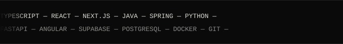

<!-- HEADER -->

  

<h3 align="center">Software Engineer @ Softsafe (Medsafe) · CS Student @ iCEV</h3>

 

  

---

### Tools, langs & frameworks

  

---

### Latest work & projects

- **[2026] Shogun** — personal JARVIS-style voice assistant built from scratch, desktop and mobile app
- **[2026] Medsafe / Paciente Integrado** — AI transcription & structured-field pipeline for clinical software
- **[2026] SafeBrain** — company AI assistant, deployed to a VPS with PM2 + Nginx
- **[2025] QA Pipeline (iCEV)** — test automation project in Python: API testing with Requests and Web E2E testing with Selenium/Pytest using the Page Objects pattern
- **[2025] PetMatch** — React Native pet-matching app (Expo, NestJS, Supabase)

---

<i>Open to new opportunities · 5th-semester CS student</i>

